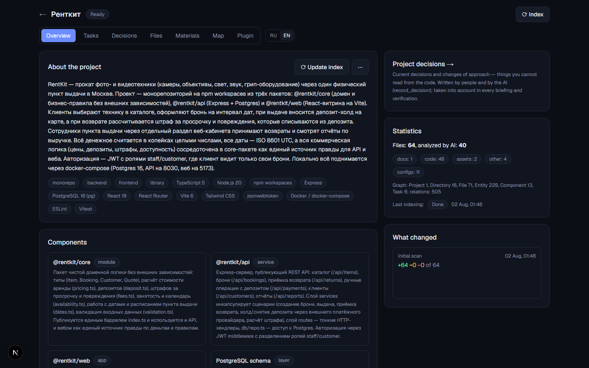
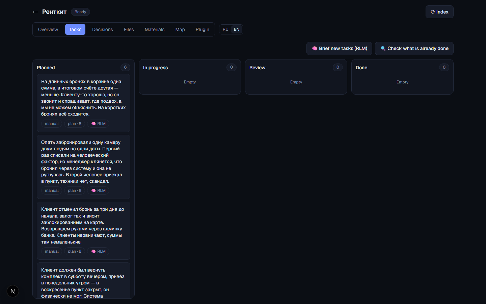
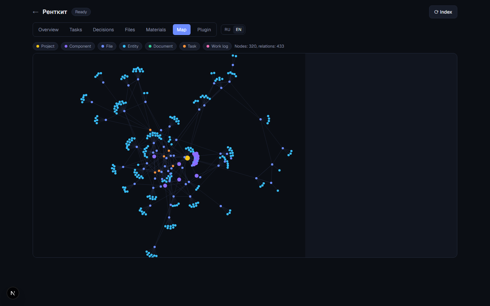

# Project AI

**A self-hosted "second brain" for a codebase.** Point it at a repository and it builds a
detailed knowledge map in Neo4j, turns messy meeting notes into engineering briefs, and
generates a Claude Code plugin so the AI in your terminal actually knows the project.

*Русская версия: [README-ru.md](README-ru.md).*

---

## The problem it solves

Working with an AI coding agent on a real project has the same failure mode every time:
the agent does not know the codebase, so it either reads half of it into its context or
guesses. Meanwhile the real knowledge lives in calls, specs and decisions that were never
written down anywhere the agent can see.

Project AI sits between the team and the codebase:

- **Knowledge map instead of a context window.** Every file is analyzed once by AI (role,
  summary, entities, links) and stored as a graph. Questions go to the graph first, code second.
- **Recursive Language Models (RLM) for big codebases.** A root agent picks groups of files
  from the map, isolated sub-agents read only their group, the root synthesizes. Sub-agents can
  ask follow-up questions and spawn their own layer. Nobody reads the whole repo.
- **Briefs, not solutions.** A one-line task from a call ("the promo code fails on the website")
  becomes a dossier grounded in the real code: how the task was understood, the likely cause
  with confidence, *where to look* and what to check there, a reference implementation nearby,
  *pitfalls* the change will touch, *how to verify*, and the open questions a human must decide.
  The executor (a person or an agent) decides how to implement.
- **Decisions are first-class.** "Role ORGANIZER was removed, now MANAGER + permissions" is
  recorded once and fed into every briefing, so leftovers of the old approach are not filed as bugs.
- **The map feeds back into Claude Code.** Each project gets a generated plugin: an MCP server
  with the knowledge map, kanban and RLM tools, plus skills (architecture, business logic,
  workflow, task briefing, how to search) regenerated from the map on every indexing run.

## Features

- **Projects** — pick a directory (native Windows folder dialog); indexing runs in the background:
  structure, stack detection, AI analysis of every file, synthesis of an overview
  (architecture, components, business logic, conventions, how-to).
- **Incremental updates** — sha256 diff (added / modified / deleted), only changed files are
  re-analyzed; a directory watcher can trigger updates automatically.
- **Multi-repo projects** — several directories in one project (e.g. separate backend and
  frontend repos): shared index, graph, search and kanban; files of extra roots are prefixed `alias/`.
- **Hybrid search** — Neo4j full-text + Qdrant semantic search with local embeddings (fastembed,
  no API cost): finds things even when the question uses different words than the code.
- **Kanban** — Planned / In progress / Review / Done with drag & drop. Tasks can be long-form;
  a ready brief is copied with one click and pasted into Claude Code. The AI manages the board
  through MCP tools: creates tasks, refines them, marks work done with a report.
- **RLM task briefing** — the pipeline described above, with duplicate / continuation detection
  against existing tasks and optional follow-up investigation of unresolved questions.
- **Planner** — decomposes a large feature into subtasks with dependencies (what blocks what).
- **Materials** — upload call recordings (mp4 / m4a / mp3 → local faster-whisper on GPU with
  CPU fallback), specs and documents (pdf / docx / xlsx / md / txt). The AI writes a summary and
  extracts tasks into the kanban. A later document can be attached as a *clarification* of an
  earlier call: the tasks born from that call are extended instead of duplicated.
- **AI verification** — for every open task the AI checks whether it is already implemented in
  the code and closes it with evidence.
- **Git import** — commit history is grouped into completed work items; matching open tasks are
  closed, partially done ones get their plan steps ticked.
- **Project duplicate** — a copy with the whole knowledge map, no repeated AI analysis.
- **Knowledge map export** — one markdown file with overview, components, decisions, tasks, files.
- **Claude Code plugin per project** — installs into the project only
  (`<project>/.claude/settings.local.json`) or globally via a local marketplace.
- **Two languages** — the UI switches between English and Russian (cookie, no URL prefixes);
  the language of AI-generated content is a separate backend setting (`AI_LANGUAGE`).

## Screenshots

The fixture project from `test_projects/rentkit` (its AI-generated content is in Russian because
that project was indexed with `AI_LANGUAGE=ru`; the UI is switched to English).

| Overview: AI-synthesized summary, stack, components, statistics | Kanban with RLM-briefed tasks worded the way they came from support |
|---|---|
|  |  |



## Architecture

```
Browser (Next.js 16, :3010) ── REST + SSE ──▶ FastAPI (:8010) ─── JobRunner (background workers)
                                                  │                   ├─ index: scan → diff → graph → AI analysis → synthesis
                                                  │                   ├─ enrich_tasks: RLM investigation → brief
                                                  │                   ├─ plan_task: RLM → subtasks with dependencies
                                                  │                   ├─ process_material: whisper / text → summary → tasks
                                                  │                   ├─ verify_tasks, git_import, plugin_generate
                                                  │
                                                  ├─ Postgres  users, projects, files, tasks, work log, materials, jobs
                                                  ├─ Neo4j     knowledge graph + full-text index
                                                  ├─ Qdrant    semantic search (local fastembed embeddings)
                                                  │
                                                  └─ claude -p (Claude Code CLI, headless)
                                                       └─ --mcp-config → MCP server "projectai" (stdio)
                                                            graph_search, graph_cypher, rlm_query, task_*, log_work, …
```

| Layer | Stack |
|---|---|
| Backend | Python 3.13, FastAPI, SQLAlchemy 2.0 (async) + Alembic, neo4j driver, qdrant-client, fastembed, faster-whisper, watchdog, FastMCP |
| Frontend | Next.js 16 (App Router, Turbopack), React 19, TypeScript, Tailwind CSS 4, next-intl, react-force-graph |
| Infra | Docker Compose: Postgres 16, Neo4j 5 (APOC), Qdrant |
| AI | Claude Code CLI in headless mode (`claude -p`) with per-call tool allow-lists and MCP config |

Details: [docs/ARCHITECTURE.md](docs/ARCHITECTURE.md) — graph schema, indexing pipeline, RLM,
briefing pipeline, security model. Roadmap: [docs/ROADMAP.md](docs/ROADMAP.md).

## Getting started

Requirements: Docker Desktop, Python 3.13 (`py` launcher on Windows), Node.js 20+, and an
installed, logged-in [Claude Code CLI](https://code.claude.com/docs/en/cli-reference).
The AI calls go through your Claude Code subscription; there is no separate API key.

```bash
git clone https://github.com/1MatrixD/Project-AI.git
cd Project-AI
cp .env.example .env        # set POSTGRES_PASSWORD, NEO4J_PASSWORD, JWT_SECRET
```

**Windows, one command** — starts the containers, installs dependencies on first run, opens the
backend and frontend in separate windows and launches the browser:

```powershell
.\start.ps1
```

**Manually (any OS):**

```bash
# 1. Infrastructure: Postgres 5432, Neo4j 7474/7687, Qdrant 6333
docker compose up -d

# 2. Backend (port 8010) — migrations run automatically on startup
cd backend
python -m venv .venv
.venv/Scripts/pip install -r requirements.txt        # Linux/macOS: .venv/bin/pip
.venv/Scripts/python -m uvicorn app.main:app --host 127.0.0.1 --port 8010

# 3. Frontend (port 3010)
cd frontend
npm install
npm run dev
```

Open http://localhost:3010, register a user, create a project and point it at a code directory.
The first indexing run analyzes up to `AI_MAX_FILES_PER_RUN` files; enable
*Analyze until the backlog is empty* in the overview menu to process a large repo in one go.

> The system is designed for a local, trusted machine: the backend reads project directories
> directly, the folder dialog is native (Windows), Whisper runs on the local GPU/CPU, and the
> API binds to 127.0.0.1. Linux/macOS work for everything except `start.ps1` and the native
> folder dialog (a built-in directory picker is used instead).

### Configuration

Everything lives in `.env` (see [.env.example](.env.example) for the full list with comments):

| Variable | Meaning |
|---|---|
| `AI_LANGUAGE` | `en` / `ru` — language of AI-generated content and background job messages. The UI language is a switch in the header. |
| `AI_MODEL`, `CHAT_DEFAULT_MODEL` | model for background analysis (sonnet by default) and for chat (opus) |
| `AI_MAX_FILES_PER_RUN`, `AI_BATCH_SIZE`, `AI_CONCURRENCY`, `JOB_CONCURRENCY` | analysis budget and parallelism |
| `RLM_MAX_DEPTH`, `RLM_BRANCHING`, `RLM_MAX_NODES` | how deep the recursive investigation may go |
| `ENRICH_FOLLOWUP` | second RLM pass over unresolved questions (slower; off by default) |
| `WHISPER_MODEL`, `WHISPER_DEVICE` | local transcription |

### Claude Code plugin

Open the *Plugin* tab of a project. *Enable in this project* writes the marketplace and the plugin
into `<project>/.claude/settings.local.json`, so Claude Code picks it up only when started in that
directory. Global installation:

```bash
claude plugin marketplace add <path-to>/data/plugins
claude plugin install projectai-<slug>@projectai
```

The plugin ships the `projectai` MCP server (knowledge map, kanban, decisions, RLM queries, work
log) and skills generated from the map. Which tool groups the external plugin may use is
configured per project in the same tab (technical operations such as re-indexing are off by default).

## Tests

```bash
cd backend
.venv/Scripts/python -m pytest -q
```

Integration tests run the whole pipeline — indexing → graph → vector search → multi-repo →
tasks → RLM briefing → planner → chat → materials → git import → SSE and cancellation →
watcher → Alembic migrations → localization — against a **fake `claude` binary** and a fake
embedder, so they cost nothing. They need the Postgres / Neo4j / Qdrant containers from
`docker compose` and create their own `projectai_test` database.

Frontend: `npm run lint` and `npx tsc --noEmit` in `frontend/`.

## Evaluation fixtures

`test_projects/` contains two deliberately tangled fictional codebases — a food-delivery service
(FastAPI + Next.js, multi-repo) and an equipment-rental monorepo (TypeScript, npm workspaces) —
with 14 tasks worded the way they arrive from support and calls, and an answer key
(`ANSWERS.md`) with the real root cause, the files that must appear in the brief and the
plausible wrong versions. They are not part of the product; they are the benchmark used to judge
whether a brief found the *actual* cause rather than the first similar-looking line.
See [test_projects/README.md](test_projects/README.md).

## Migrations

The Postgres schema is defined by the SQLAlchemy models in `backend/app/models.py`; revisions
live in `backend/alembic/versions/`. Migrations run automatically when the backend starts, so
after `git pull` a restart is enough. To add one:

```bash
cd backend
.venv/Scripts/alembic revision --autogenerate -m "short description"
```

Always read the generated file: autogenerate turns a column rename into drop + add (silent data
loss) — rewrite such places with `op.alter_column(..., new_column_name=...)`. Then
`alembic upgrade head`. Neo4j and Qdrant need no migrations: the graph is rebuilt by indexing
and the vector collection recreates itself.

## Repository layout

```
backend/
  app/main.py             FastAPI app, routers, background job registration
  app/routers/            projects, files, tasks, materials, chats, decisions, jobs (SSE), fs, auth
  app/services/           indexer, scanner, graphdb, vectors, rlm, task_enrich, planner,
                          materials, transcribe, extract, git_import, plugin_gen, export, watcher
  app/mcp/server.py       stdio MCP server used by claude -p and by the generated plugins
  app/i18n.py             backend message localization (Accept-Language / AI_LANGUAGE)
  alembic/                migrations
  tests/                  integration tests + fake claude binary
frontend/
  src/app/                Next.js routes (projects, project tabs)
  src/components/         UI; project tabs live in components/project/
  src/i18n/, messages/    next-intl setup and the RU / EN catalogues
docs/                     architecture and roadmap (EN + RU)
test_projects/            evaluation fixtures with tasks and an answer key
docker-compose.yml        Postgres, Neo4j, Qdrant
start.ps1                 one-command start on Windows
```

## Status

An experimental single-user tool built and used on one developer's machine. What works is
covered by the integration tests above; what is not there yet is in the [roadmap](docs/ROADMAP.md)
(speaker diarization, OCR for scanned PDFs, team mode, autonomous "do the task" agents).

## Contributing and license

Issues and pull requests are welcome, see [CONTRIBUTING.md](CONTRIBUTING.md).

Released under the [MIT License](LICENSE).
